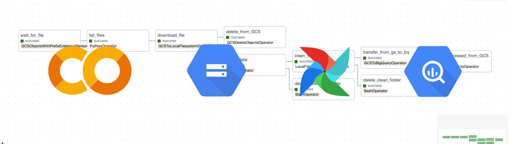

# Food Delivery Airflow ETL Data Pipeline

This project is for a food delivery company. At the end of each business day, a CSV file with daily transactions is uploaded to a folder in Google Cloud Storage (GCS). The objective is to extract, transform, and load the data into a warehouse for future data analysis. 

The ETL pipeline is built to handle batch transactions. It could be adapted to run at different times based on the business needs. Apache Airflow is used to orchestrate the data pipeline. The main steps are outlined below:

* Load the CSV file with daily transactions from GCS to a dedicated workstation
* Read and transform the data, and output the cleaned data in a CSV file using pandas
* Upload the processed CSV file back to GCS 
* Load the data into a BigQuery table

Initial data exploration of a sample CSV using [Google Colab](https://colab.research.google.com/drive/1hDmEUaY3SmjFDCEodYh0IyWJOrkl4P7-?usp=sharing) revealed the steps to clean the data before storing it in BigQuery:
* Remove duplicate rows
* Remove trailing colons from items
* Remove special characters from items

These operations are going to be implemented as a **PythonOperator** in the data pipeline.

The complete data exploration notebook can be found in the Google Colab [document](https://colab.research.google.com/drive/1hDmEUaY3SmjFDCEodYh0IyWJOrkl4P7-?usp=sharing).


After each successful Airflow task run, the original files/data are deleted. 

If the business grows and so does the volume of data, this pipeline can be moved to Cloud Composer (fully managed workflow orchestration service built on Apache Airflow). Transformation tasks can then be handled with either Spark and/or Dataflow/Apache Beam.

DAG definition including default arguments from [food_service.py](./airflow/dags/food_service.py/):
```python
default_args = {
    "owner": "JD",
    "retries": 1,
    "retry_delay": timedelta(minutes=3),
    # google cloud operator/sesor parameters
    "gcp_conn_id": "google_cloud_food_service",
    "google_cloud_conn_id": "google_cloud_food_service",
    "prefix": "food_daily",
    # GCS bucket name
    "bucket": "food-orders-us",
    "bucket_name": "food-orders-us",
    # other parameters
    "params": {
        "local_path":"/tmp/food",
        # destination folder for cleaned files in GCS bucket
        "dest": "processed/", 
        # folder for clean data on local
        "clean_dest": "clean"
    }
}
with DAG(dag_id="food_service_pipeline",
         schedule_interval="@daily",
         start_date=pendulum.datetime(2024, 3, 21, tz=time_zone),
         default_args=default_args,
         max_active_runs=1,
         catchup=False
         ) as dag:
```
As can be seen above, I used default arguments and parameters before the DAG definition. The default arguments are automatically passed as such into airflow tasks. This is a very handy feature as you can't create variables/constants outside of DAG since it's a configuration file that outlines the structure of the pipeline. The actual tasks or operators will likely run in a different context. 

## Step I - Download the CSV File 
The CSV file includes daily transactions. More details about the data can be found in the Google Colab [notebook](https://colab.research.google.com/drive/1hDmEUaY3SmjFDCEodYh0IyWJOrkl4P7-?usp=sharing).

I used **GCSObjectsWithPrefixExistenceSensor** to monitor for the data file arrival in GCS bucket. Since each file has a suffix with the business date, a prefix parameter was passed to the sensor. Once the file is in the GCS bucket, another **PythonOperator** is run to get a full file name. The file name is stored in Airflow XCOM so it can be accessed by different tasks. **GCSToLocalFilesystemOperator** is used to download the file from the GCS bucket to the local storage.

## Step II - Data Clean Up
After the file is downloaded, the data cleanup starts with **PythonOperator**. To keep the DAG file uncluttered, the code for this task is in [cleanup.py](./airflow/dags/scripts/cleanup.py). The steps for cleaning the data were outlined above. Cleaned data then saved locally as a CSV file in the /temp/food/clean location.

## Step III - Upload Processed Data to GCS
The CSV file with processed data is uploaded into "processed" folder in GCS using **LocalFilesystemToGCSOperator** operator. All files then deleted from the local storage using **BashOperator**.

## Step IV - Load Processed Data into BigQuery
In this task, the data is appended to a BigQuery table using **GCSToBigQueryOperator**. A schema for the table can be found in [schema.json](./files/schema.json) file. The copy of the schema file is in a folder on the GCS bucket since it's required for the initial run of the **GCSToBigQueryOperator**. This location is passed as 'schema_object' parameter to the operator.

Below is the image of the schema from the BigQuery after the table was created:


## Technologies
BigQuery, Cloud Storage, Apache Airflow, Docker, Python, pandas. 